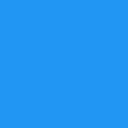

<p align="center">
  
</p>

<h1 align="center">TabBuilder</h1>

<p align="center">
  <strong>Enterprise Project Generator for Visual Studio Code</strong><br/>
  Generate production-ready projects using official CLIs and best practices.
</p>

<p align="center">
  <a href="https://marketplace.visualstudio.com/items?itemName=Meikuto.tabbuilder">
    
  </a>
  &nbsp;
  <a href="https://github.com/TzerK-LAST/TabBuilder">
    
  </a>
  &nbsp;
  <a href="https://meikuto.dev">
    
  </a>
  &nbsp;
  
</p>

---

## What is TabBuilder?

**TabBuilder** is a VS Code extension that scaffolds enterprise-grade projects directly from your editor — no templates to copy-paste, no manual CLI juggling. In a 5-step guided wizard you choose a framework, an architecture pattern, a database, DevOps configuration, and hit **Generate**. TabBuilder delegates to the **official CLI** for each framework (Spring Initializr, `dotnet new`, `laravel new`, `npm create`, …) so every generated project reflects current best practices.

---

## Features

| | |
|---|---|
| **21 frameworks** | Java, Python, C#, PHP and JavaScript/TypeScript |
| **Architecture patterns** | MVC, Clean Architecture, Hexagonal, DDD |
| **Database integrations** | PostgreSQL, MySQL / MariaDB, SQLite, MongoDB |
| **DevOps in one click** | Docker, Kubernetes, GitHub Actions, Azure Pipelines |
| **5-step wizard** | Framework → Architecture → Database → DevOps → Summary |
| **Official CLIs** | Spring Initializr, `dotnet new`, `laravel new`, `npm create`, Composer, … |
| **Framework-specific READMEs** | Real commands, not generic templates |
| **Runtime checks** | Warns when JDK, Python, .NET SDK, etc. is missing |
| **Auto install** | Runs `npm install`, `dotnet restore`, `pip install` automatically |
| **Offline-first** | No internet required beyond the framework CLI call itself |
| **No AI / No API keys** | Fully deterministic, reproducible output |

---

## Supported Frameworks

| Language | Frameworks |
|---|---|
| **Java** | Spring Boot · Quarkus · Micronaut |
| **Python** | Django · FastAPI · Flask · Litestar |
| **C#** | ASP.NET Core · Blazor |
| **PHP** | Laravel · Symfony |
| **JavaScript / TypeScript** | Next.js · React + Vite · NestJS · Express · Vue + Vite · SvelteKit · Astro · Nuxt 3 · Hono · Angular |

---

## Supported Architectures

| Pattern | Description |
|---|---|
| **MVC** | Model-View-Controller — server-rendered web applications |
| **Clean Architecture** | Layered design with dependency inversion — scalable backends |
| **Hexagonal** | Ports & Adapters — highly testable, decoupled services |
| **DDD** | Domain-Driven Design — complex business domains |

---

## DevOps Options

| Option | Files Generated |
|---|---|
| **Docker** | `Dockerfile` · `docker-compose.yml` · `.dockerignore` |
| **Kubernetes** | Dockerfile + `k8s/` manifests (deployment, service, ingress, configmap, secrets) |
| **GitHub Actions** | `.github/workflows/ci.yml` |
| **Azure Pipelines** | `azure-pipelines.yml` with test and Docker stages |

---

## Installation

**From the Marketplace:**

1. Open VS Code
2. Press `Ctrl+P` (`Cmd+P` on Mac) and run:
   ```
   ext install Meikuto.tabbuilder
   ```

**From the Extensions sidebar:**

Search **TabBuilder** — install the extension by **Meikuto**.

---

## Quick Start

1. Click the **TabBuilder** icon in the Activity Bar (or press `Ctrl+Shift+N` / `Cmd+Shift+N`)
2. Enter a **project name** and select a **destination folder**
3. Choose your **framework**
4. Select an **architecture** pattern
5. Configure **database** and **DevOps** options (both optional)
6. Click **Generate project** — TabBuilder does the rest

---

## Requirements

Make sure the CLI for your chosen framework is available:

| Language | Requirement |
|---|---|
| Java | JDK 17+ and Maven or Gradle |
| Python | Python 3.8+ and pip |
| C# | .NET SDK 8+ |
| PHP | Composer and Laravel Installer (`composer global require laravel/installer`) |
| JS / TS | Node.js 18+ and npm |

TabBuilder will warn you at generation time if a required tool is missing.

---

## Links

| | |
|---|---|
| **Marketplace** | [marketplace.visualstudio.com — Meikuto.tabbuilder](https://marketplace.visualstudio.com/items?itemName=Meikuto.tabbuilder) |
| **GitHub** | [github.com/TzerK-LAST/TabBuilder](https://github.com/TzerK-LAST/TabBuilder) |
| **Website** | [meikuto.dev](https://meikuto.dev) |
| **Issues** | [github.com/TzerK-LAST/TabBuilder/issues](https://github.com/TzerK-LAST/TabBuilder/issues) |

---

## Roadmap

- [ ] Additional frameworks (Fastify, Fiber, Gin, Rails)
- [ ] Additional architecture patterns (Event Sourcing, CQRS)
- [ ] Custom template library
- [ ] Multi-project workspace support

---

## Contributing

Pull requests are welcome. Please open an issue on [GitHub](https://github.com/TzerK-LAST/TabBuilder/issues) first to discuss what you would like to change.

---

## License

MIT © [Meikuto](https://meikuto.dev)
